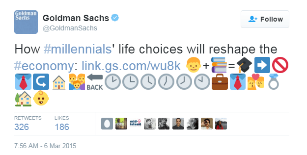

### Background

I did this project back in March 2021. I had just started with my Masters in Computer Science program and because of the
pandemic the university was online. It was a grim time as India was battling with its second and the deadliest wave of Covid.
Vaccines had recently rolled out in India and most of us were still struggling to book an appointment. But there was a 
lot of uncertainties among public regarding the vaccines as there were at least 5 different vaccines that have 
been introduced in market.

During that time, I had just started exploring the field of NLP, and was eager to put my hands on it. So I thought why 
not use the NLP to analyse the sentiments of public regarding different vaccines. I had previous experience in web scraping 
and there is no better way to learn than to apply it to a real world problem.

Now, this was at the time when Large Language Models ([ChatGPT](https://chat.openai.com)) were unheard of, and every problem was being solved using some
kind of Neural Network, but because I wanted this to be an introduction to NLP, I went with the tradition ML based NLP.

### Dataset

I don't know about you, but finding the dataset has been the most time-consuming step in my project's lifecycle. But I took a different approach with this.
First things first, to perform any kind of analysis,You can search online and find some good datasets
find some datasets, like this [one](https://www.kaggle.com/datasets/gpreda/all-covid19-vaccines-tweets).
But, public opinion can change over time, I couldn't use an old dataset. So I decided to create my own dataset that has the most recent tweets.
And to solve my problem, I used the [Tweepy](https://www.tweepy.org). Tweepy is a python library can filter tweets based on location, hashtags and language of tweets. This 
feature came in handy to extract tweet from a particular region or tweets about a particular vaccine.

### Data Pre-processing

If you have ever seen a tweet, you will know that tweets are not in textbook format. Tweets generally contains slangs, abbreviations,
emojis, hashtags, shorthands, which makes the data-preprocessing a little trickier.

Take example of the above tweet. This tweet contains informal language and emojis, and if you have used Twitter before, you would
know that's pretty much an average tweet looks like. But unfortunately, computer doesn't understand the meaning of emojis and slang.
Now looking at tweets, one choice of processing would be to delete these abbreviations and emojis but that would change the sentiment of tweet altogether.
Like this, every data processing problem is unique and the steps you take to handle data completely depends on the kind of data you have and what is your objective.
For my problem I changed the emojis to their corresponding meaning and lemmatized the abbreviations. There are various libraries that exist to 
achieve this task, or you can make your own functions. 

### The Machine Learning

As the title suggests, this where the "magic" happens. Though these machine learning algorithms have been 
shadowed by the GPT-3 and BERT but these algorithms are essential to learn to for a beginner to understand how
math can make a machine learn patterns and predict very accurate outcomes.

For my project I used [Naive Bayes](https://www.youtube.com/watch?v=O2L2Uv9pdDA), [Random Forest](https://www.youtube.com/watch?v=J4Wdy0Wc_xQ),
[Support Vector Machine](https://www.youtube.com/watch?v=efR1C6CvhmE). If you don't have a background in Machine Learning 
and/or suffer from mathematical anxiety, libraries like sci-kit lets you use these algorithms in your python notebook 
by adding a few lines of [code](https://scikit-learn.org/stable/supervised_learning.html).

<!---
#### Bias and Variance

In machine learning, we often train models to make predictions or decisions based on data. Bias and variance are two 
important concepts that help us understand how well our model performs.

Bias refers to the error that occurs due to the simplifying assumptions made by the model. 
A model with high bias tends to be too simple, making strong assumptions that may not be realistic. For example, if we 
have a linear regression model to predict housing prices but the model assumes that the relationship between 
the features and the price is always a straight line, it might struggle to capture more complex patterns, leading to high bias.

Variance, on the other hand, refers to the amount that the predictions of a model vary for different training sets. 
It measures the model's sensitivity to the specific data points it's trained on. A model with high variance is overly 
complex and can "overfit" the training data. This leads to poor performance when the model encounters new, unseen data.
To achieve good predictive performance, we aim to strike a balance between bias and variance. 
This is known as the bias-variance tradeoff.
We want our model to have enough complexity to capture the underlying patterns in the data (low bias) while avoiding
over-fitting and maintaining generalizability (low variance).
Understanding bias and variance allows us to diagnose and address issues with our models.
--->
# References

Josh Starmer : [Naive Bayes](https://www.youtube.com/watch?v=O2L2Uv9pdDA), [Random Forest](https://www.youtube.com/watch?v=J4Wdy0Wc_xQ)